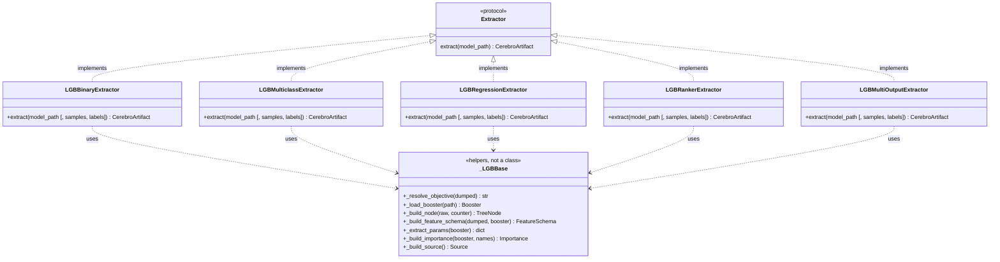
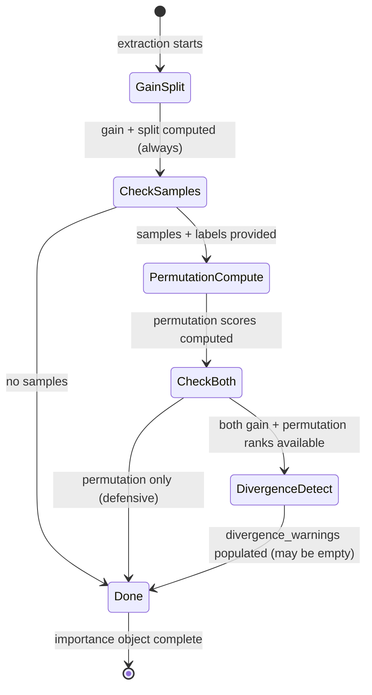

# Variant Coverage — design

> Companion to `proposal.md`. Records the architecture decisions, API
> contracts, schema delta, and technical approach for all five LightGBM
> variants, importance computation, and two new dashboard views.

## Variant dispatch architecture

The M1 `LGBExtractor` is a single monolithic class with all logic in
private methods. M2 extracts the shared logic into `_lightgbm_base.py`
and creates per-variant classes that implement the `Extractor` Protocol.



`_LGBBase` is a module of pure functions, not a class. There's no
inheritance chain — each extractor calls the shared helpers directly.
A per-variant class is ~60 lines; the shared module is ~200 lines
(mostly M1's existing private methods, moved).

`LGBExtractor` (M1) stays as-is in `lightgbm.py` for backward compat
in existing tests. After M2 ships, tests migrate to the new extractors
and `LGBExtractor` is deprecated.

## Importance computation flow



### Always-computed (gain/split)

Calls `booster.feature_importance(importance_type="gain")` and
`booster.feature_importance(importance_type="split")` — no extra
dependencies, zero additional cost, runs in <1ms for any booster size.
These are the only importance types available when samples are not
provided.

### Conditional (permutation)

```python
def compute_permutation_importance(
    booster: lgb.Booster,
    samples: np.ndarray,
    labels: np.ndarray,
    feature_names: list[str],
) -> dict[str, dict[str, float]]:
```

Uses `sklearn.inspection.permutation_importance` with
`scoring="neg_log_loss"` (for classifiers) or `scoring="neg_mean_squared_error"`
(for regressors). The booster's `predict()` method is the estimator — no
re-training, no model rehydration beyond what the booster already provides.

Returns `{name: {"mean": float, "std": float}}` keyed by feature name.

The extractor signature becomes:

```python
def extract(
    self,
    model_path: str | Path,
    samples: np.ndarray | None = None,
    labels: np.ndarray | None = None,
) -> CerebroArtifact: ...
```

Both or neither must be provided. Passing one without the other raises
a validation error at extractor entry. When both are provided:
`importance.permutation` is populated and divergence is computed.

### Divergence detection

```python
def detect_divergence(
    gain_scores: dict[str, float],
    permutation_scores: dict[str, dict[str, float]],
    feature_names: list[str],
    threshold: int = 5,
) -> list[dict[str, str | int | float]]:
```

1. Sort features by gain score (descending) → gain rank (1 = highest gain).
2. Sort features by permutation mean (descending) → permutation rank.
3. For each feature where `|gain_rank - perm_rank| > threshold`:
   append `{"feature": name, "gain_rank": g, "permutation_rank": p, "delta": d}`.
4. Sort result by delta descending (most divergent first).

The threshold defaults to 5 ranks. It's passed as an extractor parameter:

```python
extractor.extract(path, divergence_threshold=3)  # more sensitive
```

## Schema delta — what changes and why

### Model (widened)

```python
# M1
objective: Literal["binary"]
num_class: Literal[1]

# M2 (wider union, relaxed constraint)
objective: Literal["binary", "multiclass", "regression", "lambdarank", "multi_output"]
num_class: int  # was Literal[1]; multiclass sets it to e.g. 3, all others set 1
```

**Compatibility**: a binary artifact with `objective: "binary"` and `num_class: 1`
validates unchanged. The widened literal includes `"binary"`; `int` includes `1`.

### Importance (additive field)

```python
# M2
divergence_warnings: list[dict[str, str | int | float]] | None = None  # NEW
```

**Compatibility**: existing artifacts with no `divergence_warnings` key
validate because the field has `default=None`.

### CerebroArtifact (additive field)

```python
# M2
rank_metadata: dict[str, Any] | None = None  # NEW — group sizes for ranker
```

**Compatibility**: existing artifacts validate; the field defaults to `None`.

### Tree (no change)

`class_index: int | None = None` was already typed nullable in M1.
Multiclass extractors set it; all other extractors leave it `None`.
No schema change needed.

### TreeNode (no change)

No changes needed. Multiclass trees have the same shape as binary trees.

### Permutation shape (unchanged from M1's forward declaration)

```python
permutation: dict[str, dict[str, float]] | None = None
```

M1 declared this shape but always set it to `None`. M2 populates it.
The type was correct from day one — no schema change.

## API contract — `GET /artifacts/{id}/importance`

Backend and frontend are built against this typed shape. The endpoint
is additive — `GET /artifacts/{id}` still serves the full artifact with
gain/split inline. The sub-resource endpoint adds permutation data and
computed ranks.

### Route

```
GET /artifacts/{artifact_id}/importance?type=gain
GET /artifacts/{artifact_id}/importance?type=split
GET /artifacts/{artifact_id}/importance?type=permutation
```

### Response (success)

```ts
interface ImportanceResponse {
  artifact_id: string;
  type: "gain" | "split" | "permutation";
  features: Array<{
    name: string;
    value: number;             // gain / split count / permutation mean
    std?: number;              // only for permutation
    rank_gain?: number;        // cross-reference rank (1 = highest gain)
    rank_divergence?: number;  // only for features flagged as divergent
  }>;
  divergence_warnings?: Array<{
    feature: string;
    gain_rank: number;
    permutation_rank: number;
    delta: number;
  }>;
}
```

### Response (no permutation data)

When permutation importance has not been computed (no samples at
extraction time), `?type=permutation` returns:

```ts
{
  artifact_id: string;
  type: "permutation";
  features: [];
  detail: "permutation importance was not computed — no evaluation samples were provided at extraction time";
}
```

HTTP 200, not 404. The endpoint exists; the data doesn't.

### Response (invalid type)

`?type=gini` → HTTP 422 with RFC-7807 body listing valid type values.

### Errors

| Condition | HTTP | Body |
|-----------|------|------|
| Artifact not found | 404 | Standard RFC-7807 |
| Corrupt artifact | 422 | Standard RFC-7807 |
| Invalid `type` param | 422 | `detail: "type must be one of: gain, split, permutation"` |

## Multi-output importance handling

Multi-output boosters have one importance vector per output (target).
The extractor stores them as a list on `importance_gain` and
`importance_split` — but the current schema uses flat `dict[str, float]`
for both fields. M2 handles this by:

1. Computing importance for each output independently.
2. For the canonical artifact: storing aggregated importance (sum across
   outputs, or the first output's vector with a metadata note).
3. Adding `rank_metadata.multi_output_importance` with the per-output
   breakdown as a structured field.

The `GET /artifacts/{id}/importance` endpoint includes an optional
`?output=0` parameter for multi-output artifacts so the frontend can
fetch per-output importance when available. For single-output artifacts
the parameter is ignored.

## Tree node structure — what `dump_model()` provides

LightGBM's `dump_model()` returns per-node data:

```json
{
  "split_index": 3,        // feature index (int)
  "split_feature": 3,      // same as split_index (int)
  "threshold": 0.5,        // split threshold (float)
  "decision_type": "<=",   // or "==" for categorical
  "left_child": {...},     // recursive
  "right_child": {...},    // recursive
  "leaf_value": 0.342,     // present on leaves
  "leaf_weight": 412,      // NOT always present (needs train data)
  "leaf_count": 412,       // NOT always present (needs train data)
  "internal_value": 0.1,   // NOT always present
  "internal_weight": 1000, // NOT always present
  "internal_count": 1000   // NOT always present
}
```

**Key constraint for the Trees view**: `leaf_count` and `internal_count`
are only present when the booster was trained with `keep_training_booster=True`
and the `Dataset` is still available. For M2's typical extraction
workflow (model file loaded from disk, no training data attached), these
fields are NOT available.

**Node inspector therefore shows**:
- Split nodes: feature name, threshold, decision type, gain (if in params).
- Leaf nodes: leaf value (raw score).
- NO sample counts, NO coverage percentages.

This is acceptable for M2 — the mockup shows sample counts and purity,
but those require training data. Sample coverage lands in M3 when the
data profile / evaluation-set ingestion is built.

## Extractor-agnostic variant selection

The CLI and API should dispatch to the correct extractor automatically.
M2 introduces a registry in `extractors/__init__.py`:

```python
_EXTRACTORS: dict[str, type[Extractor]] = {
    "binary": LGBBinaryExtractor,
    "multiclass": LGBMulticlassExtractor,
    "regression": LGBRegressionExtractor,
    "lambdarank": LGBRankerExtractor,
    "multi_output": LGBMultiOutputExtractor,
}

def get_extractor(model_path: str | Path) -> Extractor:
    """Load booster, detect objective, return matching extractor."""
    booster = _load_booster(Path(model_path))
    objective = _resolve_objective(booster.dump_model())
    cls = _EXTRACTORS.get(objective)
    if cls is None:
        raise UnsupportedObjectiveError(...)
    return cls()
```

The CLI `cerebro extract` uses `get_extractor(model_path)` automatically.
The user never picks a variant — the booster declares its objective.

## UI view layouts (matching the mockup)

### Importance view

```
┌──────────────────────────────────────────────────────────────┐
│ Feature importance                                          │
│ Built-in LightGBM importance plus permutation importance     │
│ computed on the held-out evaluation set.                    │
├─────────────────────────────┬───────────────────────────────┤
│ Aggregate importance        │ Gain vs permutation           │
│ [gain] [split] [permutation] │ divergence                    │
│                             │                               │
│ credit_score     ████████   │ When feature's permutation    │
│                  2,847.3    │ importance is far lower...    │
│ debt_to_income   ██████     │                               │
│                  2,218.6    │ credit_score    ████████ +0.02│
│ annual_income    █████      │ debt_to_income  ██████   +0.04│
│                  1,824.0    │ annual_income   █████    -0.04│
│ ...                         │ state           ██       -0.74│
│                             │ loan_purpose    █        -0.58│
│                             │                               │
│                             │ ⚠ Heads up. state and         │
│                             │ loan_purpose have high gain   │
│                             │ but low permutation importance│
└─────────────────────────────┴───────────────────────────────┘
```

All styling uses the `.fi-` CSS classes already defined in `globals.css`.
No charting library needed — CSS bars match the mockup exactly.

### Trees view

```
┌──────────────────────────────────────────────────────────────┐
│ Tree topology                                               │
│ Every split, every threshold, every leaf — extracted from   │
│ the booster. Click any node to inspect.                     │
├──────────────────────────────────────────────────────────────┤
│ Tree: [#0 · iter 1 ▼]  Depth: [All (6) ▼]  Highlight: [...] │
│                                              17 nodes · 9... │
├──────────────────────────┬───────────────────────────────────┤
│                          │                                   │
│     ┌─── credit_score ───│── Node #3                        │
│     │    ≤ 680.5         │  feature: debt_to_income          │
│  ┌──┼──┐                 │  threshold: 0.42                 │
│  │  │  │                 │  decision: ≤                     │
│ ...  ...   ...           │  gain:   287.4                   │
│                          │                                   │
└──────────────────────────┴───────────────────────────────────┘
```

`react-d3-tree` is imported lazily:

```ts
const Tree = React.lazy(() => import("react-d3-tree"));
```

The wrapper component (`TreeViz.tsx`) transforms the canonical `Tree` →
`react-d3-tree`'s expected data shape. Node click → inspect panel on the
right side. The tree selector dropdown is a native `<select>` populated
from `artifact.trees`.

The mockup uses a hand-drawn static SVG for the tree visualization.
M2 uses `react-d3-tree` instead because:
- The mockup's SVG is 187 static elements for one tree. We need to
  render *any* tree from the canonical data dynamically.
- `react-d3-tree` handles layout, zoom, pan, and click events.
- Lazy-loading keeps it out of the initial bundle.

## Module boundaries (import-linter)

After M2:

- `cerebro.schema.v1` — still pure Pydantic, no `lightgbm` import.
- `cerebro.extractors._lightgbm_base` — `lightgbm` lives here and in
  per-variant files. Consumption modules are forbidden from importing it.
- `cerebro.analyzers.importance` — imports `numpy` and `sklearn`, never
  `lightgbm` directly (it receives the booster as a parameter from the
  extractor). Consumption-safe.
- `cerebro.api.routes.importance` — imports `storage`, `schema.v1`,
  and `analyzers.importance` (for the permutation/divergence logic,
  not the extractor). Never `lightgbm` or `extractors`.
- UI — never imports any backend module.

The `lint-imports` contract set grows from 2 to 3:
1. Extraction-side modules only import LightGBM (unchanged).
2. Consumption-side modules never import LightGBM (unchanged).
3. `analyzers/` never imports `extractors/` (new).

## What the snapshot tests assert

One test file per variant. Each:

1. Trains a small model of the appropriate variant type.
2. Extracts via the per-variant extractor.
3. Compares the canonical output against a committed example in `examples/`.
4. Assert: schema validates, tree count matches, objective matches,
   importance keys are the feature names, variant-specific fields
   are populated (multiclass: `class_index` on every tree; ranker:
   `rank_metadata` has `group_sizes`; multi-output: importance
   breakdown present).

The committed examples are NOT regenerated at test time — they are
the source of truth. A snapshot test failure means either the extractor
logic changed (and the example needs updating after deliberate review)
or a regression was introduced.

## Decisions and trade-offs

### Why CSS bars, not Reaviz, for importance

The mockup uses simple CSS bar charts (`.fi-bar`). They match the
mockup pixel-for-pixel, have zero bundle cost, and the data is simple
(sorted list of feature→value). Reaviz would add ~50 kB to the UI
bundle for a visual that's identical. If the importance view ever
needs interactive charts (zoom, tooltips, selection), Reaviz can be
added then — the `ImportanceBarChart` component abstracts the rendering.

### Why react-d3-tree and not d3 directly

Writing a tree layout in raw d3 is ~400 lines of careful math and
animation handling. `react-d3-tree` is ~15 kB gzipped, handles
layout/zoom/pan/click out of the box, and integrates with React
component lifecycle. The trade-off is that it's opinionated about
the node shape — but that opinion matches the mockup's intent
(clustered nodes with text labels). If future customization needs
require raw d3, the `TreeViz.tsx` component is the boundary; nothing
else in the codebase knows about the tree library.

### Why not bind permutation to the extractor

Permutation importance lives in `analyzers/importance.py`, not in the
extractor. The extractor *calls* it but the logic is separate. This
lets the API endpoint serve permutation data from the analyzer (for
artifacts that have samples) without forcing the extractor to know
about sklearn. It also means the divergence detection logic is
testable independently of LightGBM.

### Why auto-detect variant from booster

The user should never type `cerebro extract --variant multiclass`.
The booster knows its objective. Auto-detection means:
- CLI: `cerebro extract model.txt` always works.
- API: the extraction endpoint (future `POST /artifacts`) works without
  a `variant` parameter.
- No UX for a concept the user shouldn't have to think about.
