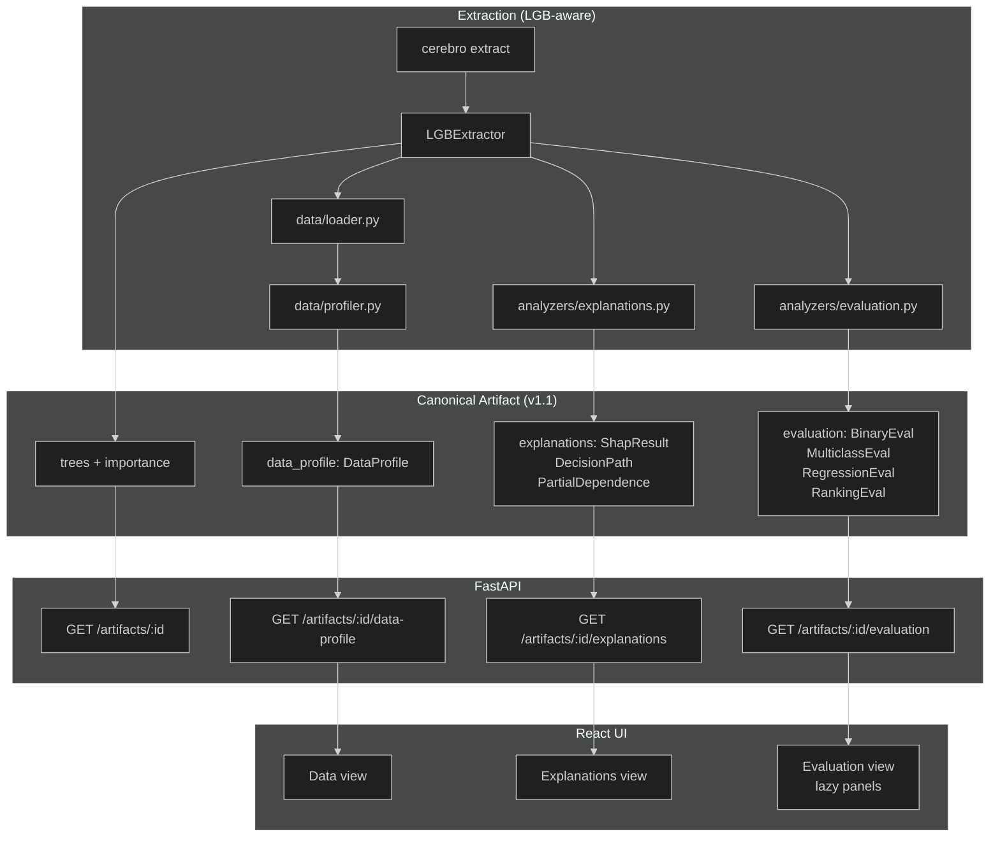

## Context

Cerebro's canonical artifact already carries `explanations: None` and
`evaluation: None` as frozen stubs. M1 and M2 proved the extraction pipeline
end-to-end for all five LGB objective variants (129 tests, all green). The
schema is at v1.0.0 and must not be edited in place — new optional fields go in
`schemas/v1.1/` following the folder-copy rule.

The key invariant throughout this change: **no consumption-side module imports
LightGBM**. SHAP's `TreeExplainer` accepts a raw booster object at extraction
time; the computed values are stored frozen in the artifact so the UI and API
never need a live model.

## Goals / Non-Goals

**Goals:**
- DuckDB-backed table loading and profiling (CSV / Parquet / JSON).
- SHAP explanations computed once at extraction; decision path and PDP derived
  from the canonical tree topology at view time.
- Objective-aware evaluation metrics computed at extraction; frozen with the
  artifact for reproducibility.
- Three new UI views (Data, Explanations, Evaluation) matching the dashboard
  mockup exactly.
- Full backwards compatibility: existing v1.0.0 artifacts validate unchanged.

**Non-Goals:**
- Live / re-computable SHAP at query time (would require model in memory).
- CatBoost / XGBoost support (v0.2+).
- Streaming / chunked table ingestion for very large datasets.
- Drift detection or temporal comparisons across artifacts.

## Decisions

### D1 — Schema extension: additive optional fields in v1.1, not a v2

v1.0.0 artifacts are in the wild (tests, examples). Bumping to v2 would require
a migration step and break `schema_version: "1.0.0"` validators. Instead:

- `schemas/v1.1/artifact.py` promotes `explanations` and `evaluation` from
  `None` to proper union types.
- `schemas/v1.1/data_profile.py` adds the optional `data_profile` field.
- The artifact class in v1.1 inherits v1 and adds `Optional` overrides.
- v1.0.0 artifacts remain valid because all new fields default to `None`.
- Consumers check `artifact.explanations is not None` before rendering panels.

**Alternative considered:** A JSON patch / overlay approach. Rejected because it
adds a diff-application step and makes schema introspection harder.

### D2 — DuckDB for table loading, not pandas

The spec mandates DuckDB for table ingestion. Concretely:
- `duckdb.connect(":memory:")` + `read_csv_auto` / `read_parquet` /
  `read_json_auto` handles all three formats with zero pandas dependency.
- Profiling (distributions, missingness, correlations) runs as DuckDB SQL
  aggregations — faster than pandas for large tables, no memory spike from
  loading to a DataFrame first.
- The connection is opened read-only (`duckdb.connect(database=":memory:")`)
  for each profiling run; no persistent state.

**Alternative considered:** pandas + pyarrow. Rejected per spec constraint
(no pandas for loading) and the goal of keeping image size predictable.

### D3 — SHAP background sampling: stratified by target, fallback uniform

When labels are provided alongside the training table, the background dataset
for SHAP's `TreeExplainer` is stratified by target quintile to avoid over- or
under-representing edge cases. When no labels are available (regression
without held-out labels, ranking), uniform random sampling is used.

Named constant: `SHAP_BACKGROUND_SAMPLES = 100` (configurable via env,
not a magic number in code).

**Alternative considered:** Full training set as background (no sampling).
Rejected because SHAP memory usage is O(n_background × n_features × n_trees).
For a 100k-row table with 200 features and 500 trees this is impractical.

### D4 — Decision path tracer: pure function over canonical TreeNode

The decision path for a single sample is computed by walking the `Tree` /
`TreeNode` structures already in the canonical artifact. No LGB import needed.
The tracer returns a `DecisionPath` with the sequence of split nodes visited
and the feature values at each split — exactly what the UI needs to highlight
in copper.

```
trace_path(tree: Tree, sample_values: list[float]) -> DecisionPath
```

This is stateless and side-effect free; suitable for testing with plain dicts.

### D5 — Evaluation panels: frozen at extraction, lazy-loaded in UI

Each panel's metrics are computed against the held-out evaluation set during
`cerebro extract --samples ... --eval-samples ...`. The results are stored as
JSON in the artifact's `evaluation` field. At view time the UI reads from the
frozen artifact — no re-computation, no live model.

Each panel (binary, multiclass, regression, ranking) is a separate React
component imported with `React.lazy()` so it only ships in the initial bundle
if the objective demands it.

### D6 — Partial dependence: top-N features, precomputed grid

PDP is computed at extraction time over the top `PDP_TOP_N_FEATURES = 10`
features by gain importance, on a grid of `PDP_GRID_POINTS = 20` values per
feature. These constants avoid runtime O(n_samples × n_features × n_grid)
cost at view time.

The PDP data stored per feature is `{feature: str, grid: list[float],
values: list[float]}` — exactly the shape Reaviz `Sparkline` accepts after
normalization.

### D7 — Multi-class SHAP rendering: per-class with aggregated toggle

For multiclass models, SHAP values have shape `(n_samples, n_classes,
n_features)`. The UI default shows the SHAP breakdown for the predicted class.
An aggregated view takes `mean(abs(shap_values), axis=1)` — the standard
global feature attribution summary. A toggle in the SampleInspector panel
switches between the two.

## Risks / Trade-offs

- **SHAP memory at extraction**: for large boosters + large sample sets,
  `TreeExplainer` can OOM. Mitigation: cap samples with `SHAP_MAX_EXPLAIN_SAMPLES
  = 1000` and log a warning if the caller provides more.
- **DuckDB version pinning**: DuckDB's SQL dialect has changed between minor
  versions. Mitigation: pin to a specific minor in `pyproject.toml`; add a
  regression test that exercises `read_csv_auto`.
- **v1.1 schema drift**: if a v1.0.0 artifact has extra fields injected from
  v1.1 and is re-read by a v1.0.0 validator, `extra="forbid"` will reject it.
  Mitigation: read path always uses the schema version declared in the artifact
  file; the registry routes the right validator.
- **PDP accuracy on categorical features**: `PDP_GRID_POINTS` over a
  continuous grid is wrong for pure categoricals. Mitigation: the profiler
  marks categorical indices (already in `FeatureSchema.categorical_indices`);
  the PDP function uses the known category set instead of a numeric grid for
  those columns.

## Migration Plan

1. Merge behind a feature branch; all new schema files are additive.
2. Existing `.cerebro.json` artifacts in `data/artifacts/` do not need
   re-extraction — they will load correctly because new fields default to `None`.
3. To obtain explanations/evaluation for an existing artifact, re-run
   `cerebro extract <model.txt> --samples ... --eval-samples ...`; the new
   extractor path overwrites the artifact file.
4. No database migration needed: registry DDL gains `has_data_profile INTEGER`
   column added with `ALTER TABLE ... ADD COLUMN ... DEFAULT 0` (idempotent on
   startup in `registry.py`).

## Open Questions

*(All resolved — documented for record)*

- **Training table JSON shape** → records-oriented (`[{col: val, ...}]`);
  columnar (`{col: [val, ...]}`) auto-detected by shape heuristic in loader.
- **SHAP background sampling** → stratified by target when labels present,
  uniform otherwise.
- **Multi-class SHAP rendering** → per-class default, aggregated summary toggle.

## Architecture Diagram


